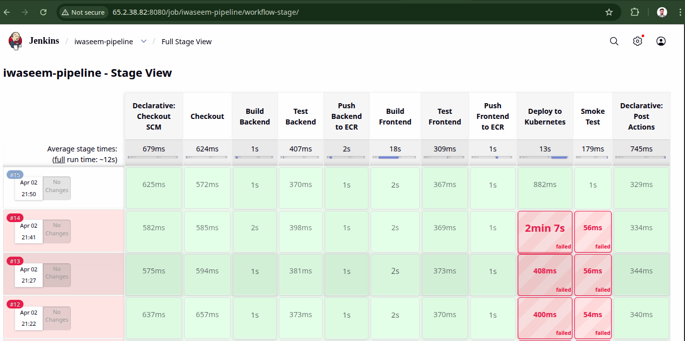
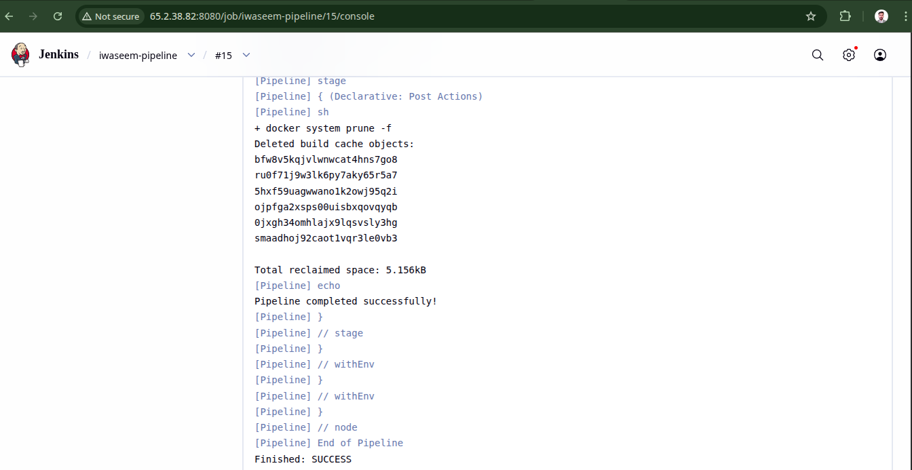
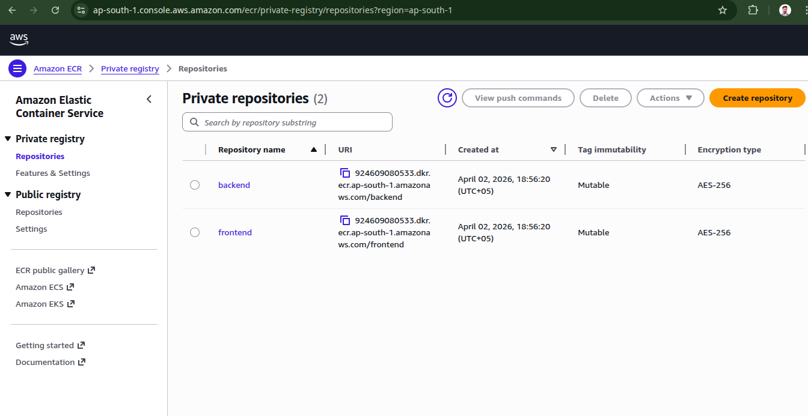
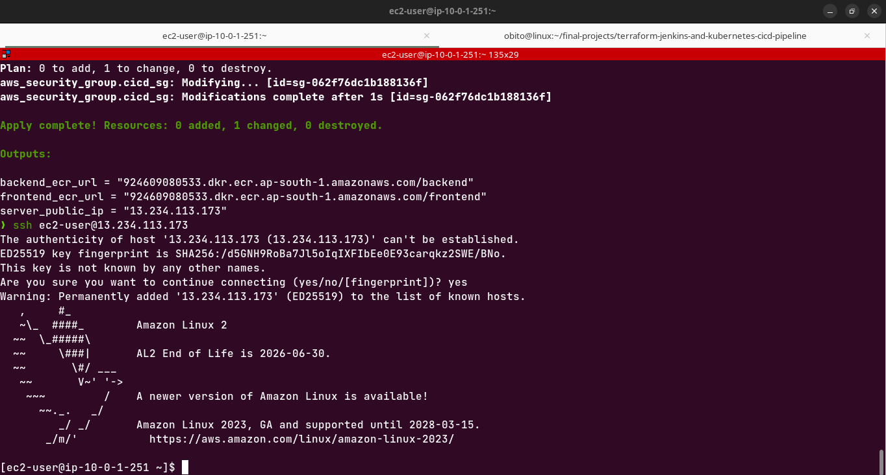
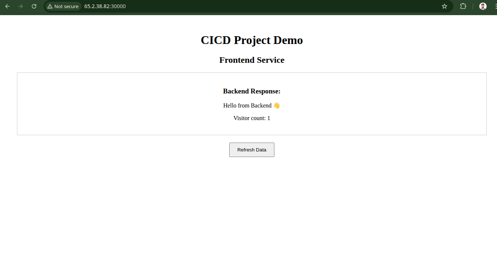

# Kubernetes CI/CD Pipeline - Jenkins + Docker + AWS ECR + K3s

> A fully automated CI/CD pipeline that builds, pushes, and deploys containerised microservices to a Kubernetes cluster on AWS — provisioned entirely with Terraform.

---

## Live Screenshots

### Jenkins Pipeline - All Stages Green



### Pipeline Success Output



### AWS ECR - Private Container Registry



### Terraform Success



### Application Running in Browser



---

## What This Project Does

A code push to GitHub triggers a Jenkins pipeline that:

1. Builds Docker images for a Node.js backend and React frontend
2. Pushes images to **private AWS ECR** repositories (not Docker Hub)
3. Deploys to a **K3s Kubernetes cluster** on EC2 using rolling updates
4. Runs a smoke test against the live frontend NodePort service

Everything — VPC, EC2, ECR repositories, IAM roles, security groups — is provisioned with Terraform. The EC2 instance runs Jenkins and K3s together, optimised to fit within AWS Free Tier.

---

## Architecture

```
Developer pushes code to GitHub
            │
            ▼
    Jenkins Pipeline (EC2)
            │
    ┌───────┴────────┐
    │                │
Build Backend    Build Frontend
(Node.js)        (React + Nginx)
    │                │
    ▼                ▼
Push to AWS ECR (Private Registry)
backend:latest   frontend:latest
    │                │
    └───────┬────────┘
            │
            ▼
  kubectl set image (Rolling Update)
            │
            ▼
  K3s Kubernetes Cluster (same EC2)
  ┌─────────────────────────────┐
  │  backend-deployment  :5000  │
  │  frontend-deployment :3000  │
  │  frontend-service    :30000 │ ◄── Browser access
  └─────────────────────────────┘
            │
            ▼
     Smoke Test (curl NodePort)
            │
            ▼
   ✅ Pipeline completed successfully
```

---

## Tech Stack

| Category      | Technology                         |
| ------------- | ---------------------------------- |
| CI/CD         | Jenkins (declarative pipeline)     |
| Containers    | Docker (multi-stage builds)        |
| Registry      | AWS ECR (private, IAM role auth)   |
| Orchestration | Kubernetes — K3s on EC2            |
| IaC           | Terraform (VPC, EC2, ECR, IAM, SG) |
| Backend       | Node.js + Express                  |
| Frontend      | React + Nginx                      |
| Cloud         | AWS EC2, ECR, VPC, IAM             |
| OS            | Amazon Linux 2                     |

---

## Key Engineering Decisions

**AWS ECR instead of Docker Hub**
Images are stored in a private ECR registry authenticated via EC2 IAM role — no credentials stored anywhere. The pipeline uses `aws ecr get-login-password | docker login` with the instance role automatically providing permissions. This is the correct production approach.

**Jenkins + K3s on single t2.micro**
Running both Jenkins and Kubernetes on one t2.micro required careful memory optimisation — 1GB swap file, Jenkins heap capped at `-Xmx512m`, K3s with traefik and servicelb disabled. This reflects real-world cost optimisation on AWS Free Tier.

**Rolling update deployment strategy**
The pipeline uses `kubectl set image` with `kubectl rollout status --timeout=120s` — zero-downtime deployment with automatic rollback on failure. Old pods are only terminated after new pods are confirmed healthy.

**IAM role instead of static credentials**
No AWS access keys anywhere in the code or Jenkins credentials. The EC2 instance has `AmazonEC2ContainerRegistryPowerUser` IAM role attached — credentials rotate automatically. This is the AWS security best practice.

**Kubeconfig with private IP**
K3s generates kubeconfig with `127.0.0.1` which fails when Jenkins connects remotely. The setup script automatically replaces `127.0.0.1` with the EC2 private IP, making kubectl work correctly from both ec2-user and Jenkins contexts.

---

## Pipeline Stages

```
Checkout
    ↓
Build Backend Image          (docker build → ECR_URL/backend:BUILD_ID)
    ↓
Test Backend                 (npm test)
    ↓
Push Backend to ECR          (docker push with IAM role auth)
    ↓
Build Frontend Image         (docker build → ECR_URL/frontend:BUILD_ID)
    ↓
Test Frontend                (npm test)
    ↓
Push Frontend to ECR         (docker push)
    ↓
Deploy to Kubernetes         (kubectl set image + rollout status)
    ↓
Smoke Test                   (curl frontend NodePort)
    ↓
✅ Pipeline completed successfully
```

---

## How to Run This Project

### Prerequisites

- AWS account with IAM permissions (EC2, ECR, VPC, IAM)
- Terraform installed locally
- AWS CLI configured locally

### Step 1 — Provision Infrastructure

```bash
git clone https://github.com/iwaseemdevops/terraform-jenkins-and-kubernetes-cicd-pipeline.git
cd terraform-jenkins-and-kubernetes-cicd-pipeline/terraform

terraform init
terraform plan
terraform apply
```

Note the outputs: `server_public_ip`, `backend_ecr_url`, `frontend_ecr_url`

### Step 2 — Run setup script on EC2

```bash
# SSH into EC2
ssh -i your-key.pem ec2-user@<server_public_ip>

# Run setup script (installs Docker, Jenkins, K3s, AWS CLI, kubectl)
chmod +x setup.sh
./setup.sh
```

The script installs everything in the correct order:

1. Creates 1GB swap file first (required for t2.micro)
2. Docker
3. Java 17 (Amazon Corretto)
4. Jenkins with memory limits (`-Xmx512m`)
5. AWS CLI v2
6. kubectl (pinned to v1.29.0)
7. K3s with traefik and servicelb disabled
8. Configures kubeconfig for both ec2-user and Jenkins

### Step 3 — Access Jenkins

```bash
# Get Jenkins initial password
sudo cat /var/lib/jenkins/secrets/initialAdminPassword
```

Open `http://<server_public_ip>:8080` and unlock Jenkins.

Install these plugins:

- Docker Pipeline
- Kubernetes CLI
- Pipeline: Stage View

### Step 4 — Configure Jenkins Credentials

Add one credential:

- ID: `k3s-kubeconfig`
- Type: Secret file
- File: upload `/tmp/kubeconfig` from the EC2 instance

No AWS credentials needed — the EC2 IAM role handles ECR authentication automatically.

### Step 5 — Apply Kubernetes Manifests (first time only)

```bash
kubectl apply -f k8s/backend-deployment.yaml
kubectl apply -f k8s/frontend-deployment.yaml
kubectl apply -f k8s/frontend-service.yaml

# Verify
kubectl get pods
kubectl get svc
```

### Step 6 — Create Jenkins Pipeline Job

- New Item → Pipeline
- Pipeline script from SCM → Git
- Repository URL: `https://github.com/iwaseemdevops/terraform-jenkins-and-kubernetes-cicd-pipeline.git`
- Script path: `Jenkinsfile`
- Click Build Now

### Step 7 — Access the Application

```bash
kubectl get svc frontend-service
# Note the NodePort (30000-32767 range)
```

Open: `http://<server_public_ip>:<nodeport>`

---

## Repository Structure

```
terraform-jenkins-and-kubernetes-cicd-pipeline/
│
├── microservices/
│   ├── backend/                 # Node.js + Express API
│   │   ├── Dockerfile
│   │   ├── package.json
│   │   └── src/
│   └── frontend/                # React app
│       ├── Dockerfile           # Multi-stage: build + Nginx
│       ├── package.json
│       └── src/
│
├── k8s/                         # Kubernetes manifests
│   ├── backend-deployment.yaml
│   ├── frontend-deployment.yaml
│   └── frontend-service.yaml    # NodePort for browser access
│
├── terraform/                   # AWS infrastructure
│   ├── main.tf                  # EC2, VPC, ECR, IAM, Security Groups
│   ├── variables.tf
│   ├── outputs.tf               # server_public_ip, ECR URLs
│   └── user_data.sh
│
├── screenshots/                 # Project documentation images
├── setup.sh                     # Full server setup automation script
├── Jenkinsfile                  # Complete CI/CD pipeline definition
└── README.md
```

---

## Real Problems Solved During This Project

This section documents real debugging challenges encountered and solved — not tutorial problems, but actual production-level issues.

| Problem                                              | Root Cause                         | Solution                                                       |
| ---------------------------------------------------- | ---------------------------------- | -------------------------------------------------------------- |
| Terraform credentials error (InvalidClientTokenId)   | Expired AWS access keys            | Ran `aws configure` with fresh keys                            |
| Jenkins fails to start (Fontconfig head is null)     | Missing fonts on EC2               | Installed `fontconfig` and `dejavu-sans-fonts`                 |
| Jenkins not accessible via browser                   | Port 8080 blocked                  | Opened security group port 8080 inbound                        |
| K3s installation fails                               | SELinux conflict on Amazon Linux 2 | Used `INSTALL_K3S_SKIP_SELINUX_RPM=true` flag                  |
| kubectl command not found                            | Not installed by default           | Downloaded and installed binary manually                       |
| Pipeline error: No such property: docker             | Missing Jenkins plugin             | Installed Docker Pipeline plugin                               |
| Docker build fails: npm ci needs lockfile            | Missing package-lock.json          | Changed to `npm install --only=production`                     |
| ECR login fails (401 Unauthorized)                   | Missing IAM permissions            | Attached `AmazonEC2ContainerRegistryPowerUser` IAM role to EC2 |
| Kubeconfig YAML parsing error in Jenkins             | Wrong credential type              | Changed from Secret text to Secret file                        |
| x509 certificate error                               | Kubeconfig using 127.0.0.1         | Replaced with EC2 private IP in setup script                   |
| Deployments not found (NotFound)                     | K8s manifests never applied        | Applied manifests manually once: `kubectl apply -f k8s/`       |
| ImagePullBackOff on pods                             | Missing ECR pull secret            | Created `kubectl create secret docker-registry ecr-secret`     |
| Frontend cannot reach backend                        | Backend on ClusterIP               | Patched backend service to NodePort                            |
| Jenkins extremely slow on t2.micro                   | Insufficient memory                | Set `-Xmx512m`, created 1GB swap, set `vm.swappiness=10`       |
| Node.js 18+ glibc incompatibility                    | Amazon Linux 2 has glibc 2.26      | Used Node.js 14 from Amazon Extras                             |
| Pipeline error: Could not find credentials aws-creds | Wrong credential ID                | Switched to IAM role — no credentials needed                   |

> These debugging sessions are what real DevOps engineering looks like. Every problem in this table represents a real failure, real investigation, and a real fix.

---

## Future Improvements

- Add real unit and integration tests replacing placeholder `echo` commands
- Use Helm charts instead of raw kubectl manifests
- Add Prometheus + Grafana monitoring
- Implement GitOps with ArgoCD
- Add staging environment before production deployment
- Set up GitHub webhook for automatic pipeline triggering

---

## Author

**Waseem Aqib** — DevOps Engineer

[](https://github.com/iwaseemdevops)
[](https://linkedin.com/in/waseemaqib)
[](mailto:iwaseemdevops@gmail.com)

---

> _"Every problem in the troubleshooting table above was a real failure that became a real lesson."_
